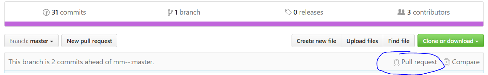
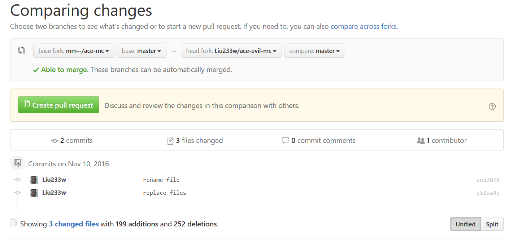
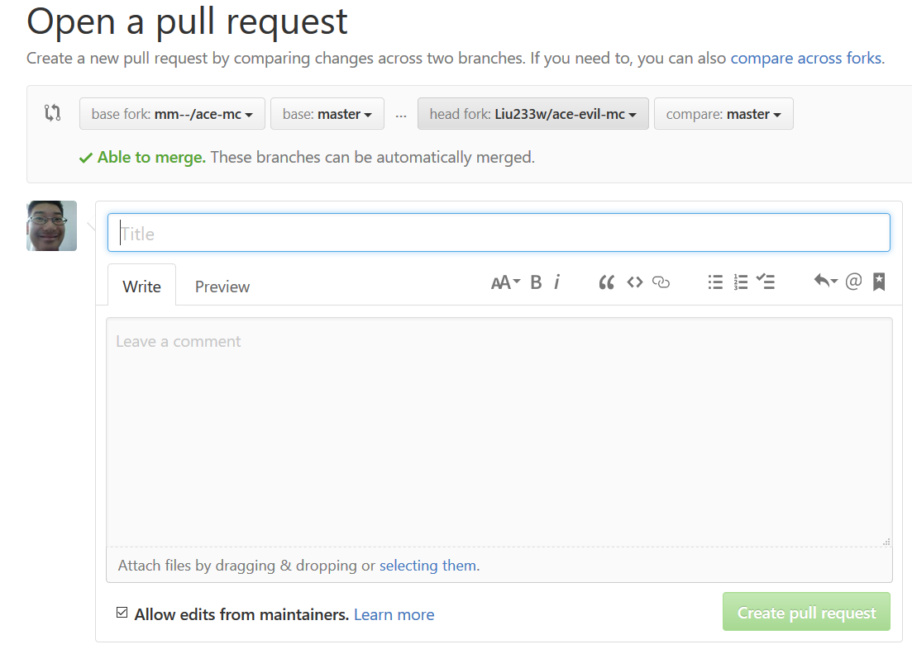

# 第二讲： github快速参考

## 项目模型
- responsitories 简称 repo
- 单击 fork 可以在你的账户里面把此 repo 复制一份，随后你对项目的修改都不会影响原先（被 fork）的项目。

## 关于 Pull Request
- 简称 PR
- 在你的项目中进行修改之后，会出现选项

- 单击此按钮后会进入比较界面，可以选择本地的分支（你要把哪个分支传给对方）和远程的分支（你想传给对方的哪个分支）

- 选好之后创建分支，在随后的页面中填入你的PR的标题（你大体做了哪些修改）和内容（每一条修改的详细信息）

