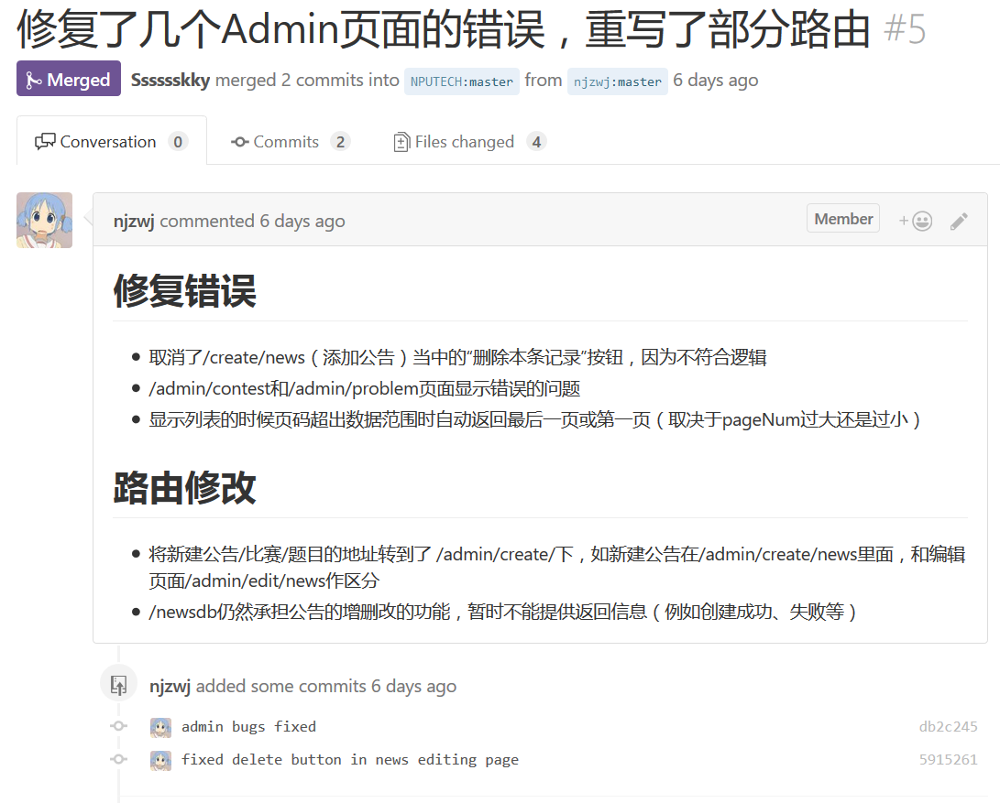
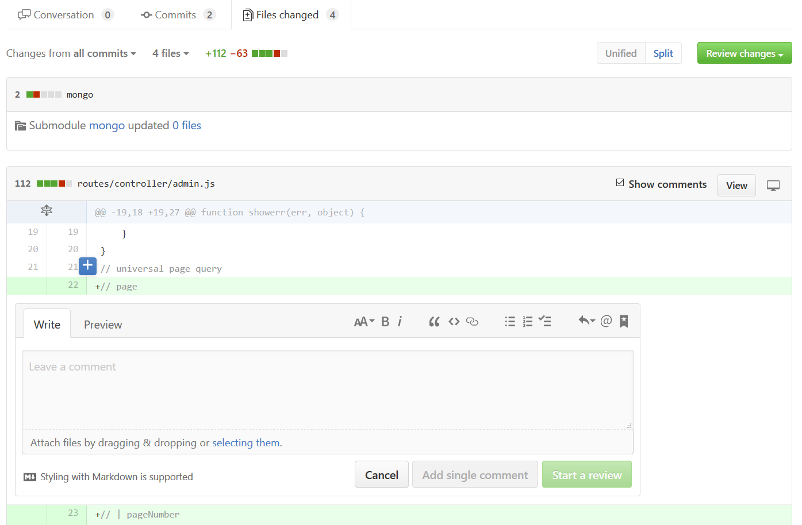

# 第二讲： github快速参考

## 项目模型
- responsitories 简称 repo
- 单击 fork 可以在你的账户里面把此 repo 复制一份，随后你对项目的修改都不会影响原先（被 fork）的项目。

## 发送 Pull Request
- 简称 PR
- 在你的项目中进行修改之后，会出现选项

- 单击此按钮后会进入比较界面，可以选择本地的分支（你要把哪个分支传给对方）和远程的分支（你想传给对方的哪个分支）

- 选好之后创建分支，在随后的页面中填入你的PR的标题（你大体做了哪些修改）和内容（每一条修改的详细信息）

- 例如：

- 同一个 repo 的多个分支之间也可以发送PR

## 接受 Pull Request
- 在界面中可以选择接受或拒绝
- 可以在 PR 中进行交流
- 发送 PR 的人在发送 PR 的分支中进行修改的时候会同步反映到自己的 PR 中
- 在合并pr之前最好先进行测试
- 测试方式 ： TODO
- 选择 `files changed` 选项可以查看此 PR 做出的修改。鼠标移动到某一行的行号处，单击出现的加号，可以对这一行作出评论。

